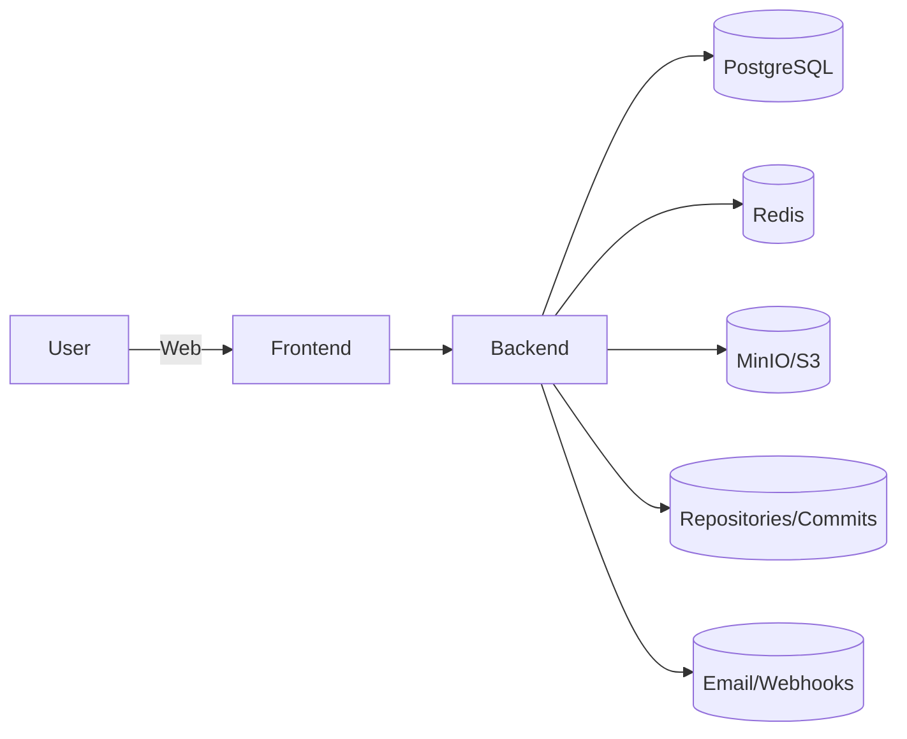

# Comprehensive and Detailed Description of the Civic AI Canon Platform (CAP)

> **Purpose:** A full, precise English translation of the Arabic master document describing CAP’s vision, components, architecture, governance, security, and operations. Formatted as Markdown, preserving structure and intent for vendor handoff and internal alignment.

## 1. Executive Summary
The **Civic AI Canon Platform (CAP)** is a verifiable, provenance‑first platform that anchors organizational knowledge, decisions, and actions into an **attested semantic canon**. It merges content, conversations, code, and operational events with cryptographic attestations and repository‑backed records (e.g., GitHub commits), enabling **semantic trust** across teams and stakeholders.

CAP serves multi‑institution deployments via **multi‑tenant** architecture, supports **local/sovereign operation**, and integrates with existing developer and content workflows. The outcome is a living Canon that makes **who did what, when, and why** durable and inspectable.

## 2. Objectives
- Establish **attestation‑driven governance** for decisions, artifacts, and operations.
- Provide **friendly, accessible web interfaces** for non‑technical users while remaining developer‑native.
- Ensure **traceability and integrity** (hashes, signatures, immutable trails).
- Support **collaboration** across projects, nodes, and partner organizations.
- Offer **analytics & reporting** for coverage, compliance, and outcomes.

## 3. Core Components
- **Attestations:** Signed records that bind context (who/what/when/why) to artifacts and actions.
- **Projects (Canon Units):** Containers grouping attestations, files, threads, tasks, and nodes.
- **Knowledge & Files:** Managed evidence and documentation with checksums and access control.
- **Conversations:** Threads with attachments and the ability to promote messages into attestation drafts.
- **Analytics & Reports:** KPIs, time‑series, and coverage metrics.
- **Nodes:** Operational entities (servers/agents) registered with keys and tracked via heartbeats.

## 4. Architecture Overview
- **Frontend:** Next.js 14 + React 18, shadcn/ui + Tailwind, React Query, Socket.IO client.
- **Backend:** NestJS feature modules (Auth, Projects, Attestations, Files, Conversations, Analytics).
- **Data:** PostgreSQL (primary), Redis (caching/queues), MinIO/S3 (binary storage).
- **Integrations:** GitHub (repos/commits), email/webhooks, calendar, virus scanning.
- **Security:** JWT (access/refresh), RBAC (roles/policies/permissions), CSP, CSRF, strict input handling.
- **i18n:** Arabic RTL and English LTR with instant language switch.
- **Time & Region:** Asia/Aden (UTC+3) with absolute timestamps in official records.

## 5. Data Model (High Level)
- `User(id, name, email, roles[], locale, createdAt)`
- `Project(id, name, code, owners[], status, createdAt, updatedAt)`
- `Attestation(id, title, type, projectId, authorId, status, hash, signature, createdAt, signedAt, extensions)`
- `Evidence(id, attestationId, fileId, description, checksum)`
- `File(id, name, type, size, checksum, uploaderId, storageKey, createdAt)`
- `Thread(id, title, projectId)` / `Message(id, threadId, authorId, content, createdAt, attachments[])`
- `Node(id, name, publicKey, status, lastSeen, capabilities[], location)`
- `Task(id, title, projectId, status, assignees[], dueAt, links[])`

## 6. Workflows (Samples)
- **Create Attestation:** Draft → Validate schema → Attach evidence → Sign/Commit → Notify reviewers.
- **Review & Approve:** Reviewer checks hash/signature → Approve/Reject → Route back with notes.
- **Register Node:** Generate keys → Verify → Link to projects → Start heartbeat.
- **Knowledge Intake:** Upload → checksum → tag → link to project/attestation → request review.

## 7. Governance & Policies
- **RBAC Matrix:** Roles mapped to policies; per‑module route guards and field‑level rules.
- **Immutability:** Attestations are append‑only; updates create new signed versions referencing prior hashes.
- **Retention:** Evidence and logs retention schedules; signed URL policies for downloads.
- **Compliance Hooks:** SLSA/SBOM alignment, audit exports, and provenance artifacts.

## 8. Security Controls
- **Authentication:** JWT with refresh rotation and short‑lived access tokens.
- **Authorization:** Policy checks on every critical action; server‑side filters for lists.
- **Transport & Storage:** TLS in transit; encrypted secrets; checksum verification for files.
- **Abuse Mitigation:** CSRF protection, rate limiting, input sanitization, strict CSP, SSRF defenses.
- **Observability:** Structured logs with correlation‑id; metrics and traces for critical paths.

## 9. Analytics & Reporting
- **Coverage:** Attestation coverage per project and over time.
- **Compliance:** Policy adherence scoring with drill‑downs.
- **Exports:** CSV/Excel/PDF; scheduled reports via email/webhook.

## 10. Environments & Delivery
- **Environments:** dev → staging → prod with seeded demo data for QA.
- **CI/CD:** Lint, type‑check, test, build; preview deployments per PR.
- **Testing:** Unit, integration, and e2e (Playwright) on critical flows and security gates.
- **Handover Artifacts:** Admin guide, runbooks, environment templates, RBAC matrix, test reports.

## 11. Roadmap (Illustrative)
1. Core shell + Auth
2. Projects + Attestations
3. Files + Conversations
4. Nodes + Analytics
5. Tasks + Reports
6. Polishing, A11y, and performance

---

### Appendix A — Glossary
- **Attestation:** A signed, verifiable record linking an action/artifact to identity and time.
- **Canon:** The durable, inspectable body of truth for an organization or collaboration.
- **Evidence:** Files and references that substantiate an attestation.
- **Ledger:** The sequence of commits, hashes, and signatures forming the provable trail.

### Appendix B — Sample Policies
- Route guards, RBAC matrices per module, data retention schedules, and signature requirements.
