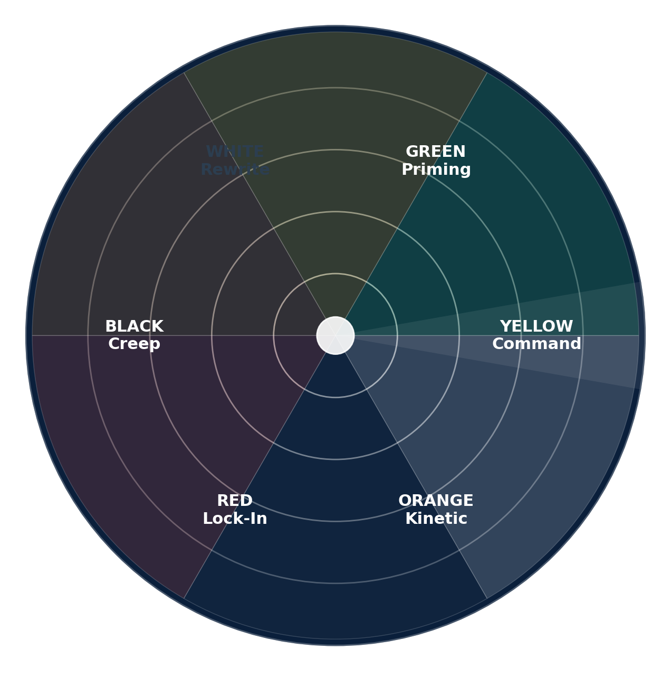

# D.C. Authoritarian Semantic Radar (Operational)
**Created:** 2025-08-11 01:24 UTC

## Streams
1. **Official Narrative:** pressers, leader posts, state media.  
2. **On‑the‑Ground:** citizen posts, live video, police scanner.  
3. **Public Sentiment:** local orgs, journalists, faith leaders.

## Phases (Dial Order)
- 🟢 **Green – Priming** (Stage 1)  
- 🟡 **Yellow – Command Override** (Stage 2)  
- 🟠 **Orange – Kinetic Show** (Stage 3)  
- 🔴 **Red – Program Lock‑In** (Stage 4)  
- ⚫ **Black – Mission Creep** (Stage 5)  
- ⚪ **White – Memory Rewrite** (Stage 6)

## Confidence Multipliers
- ×3 Direct official order  
- ×2 Coordinated media push  
- ×1 Single-source rumor

## Visual

