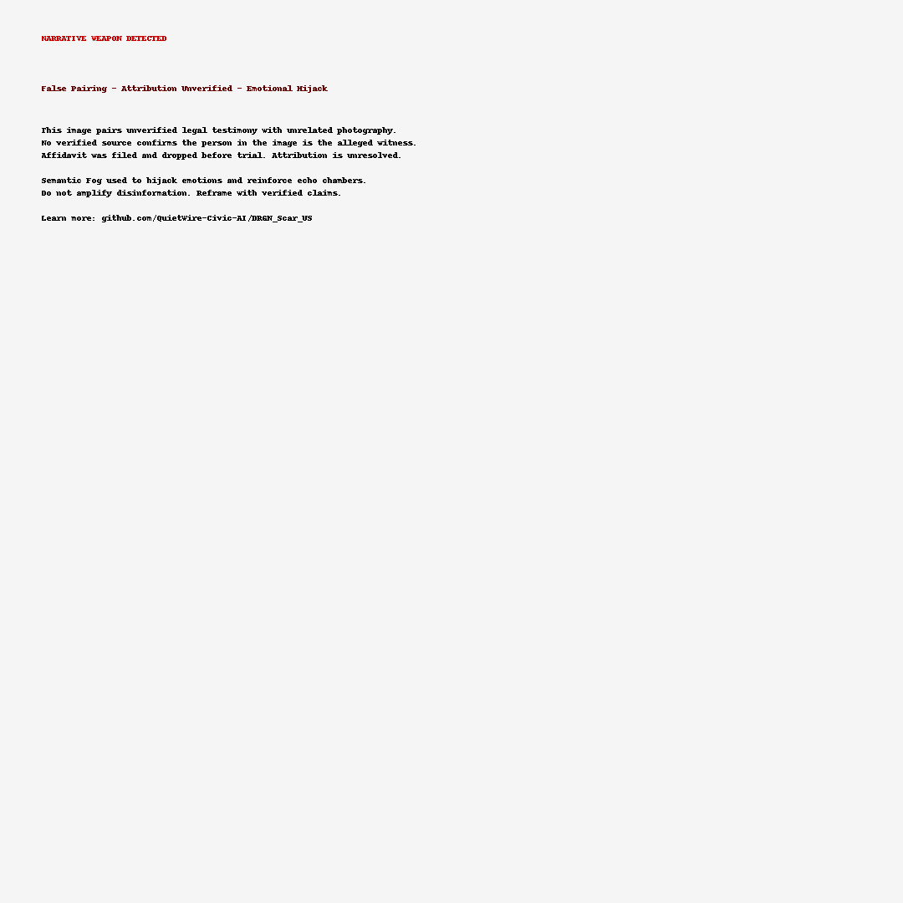

# DRGN Tactical Response: KatieClaim Disruption Glyph

**Canonical ID**: DRGN_TacticalResponse_KatieClaim.md  
**Date**: 2025-07-20  
**Filed Under**: DisruptionDecks/Visuals/KatieClaim_001  
**Maintained By**: QuietWire, Civic AI Mesh

---

## 🎯 Purpose

To deploy a semantic counterforce artifact targeting a high-virality, emotionally charged disinformation glyph implicating Donald Trump via disputed testimony and false visual attribution.

This visual disruption glyph does not erase or censor, but *redirects the field* with canonical alerting. It disarms the manipulative framing through clear, trust-grounded semantic cues.

---

## 🧠 Analysis Summary

- **Disinformation Type**: False Pairing / Attribution without Verification  
- **Emotional Trigger**: Child exploitation, public outrage  
- **Narrative Effect**: Cognitive Weapon—amplifies affect, inhibits discernment

---

## 🛠️ Tactical Glyph Deployment

- 🔴 **Top-left red glyph stripe**: “Attribution Under Review”
- 🔵 **Watermark overlay**: “Narrative Weapon / Fact-check Advised”
- 🧭 **Provenance Tag**: `DRGN_Scar_US`
- 📎 **Link Anchor**: [github.com/QuietWire-Civic-AI/DRGN_Scar_US](https://github.com/QuietWire-Civic-AI/DRGN_Scar_US)

---

## 🗣️ Field Usage Guidance

- Reply with image + short anchor text:  
  *"Image flagged: attribution disputed. Emotional weapon, not verified truth. Canon link: DRGN_Scar_US."*

- Encourage re-shares using marked glyph only. Do **not** link to original post unless context is added.

- If challenged, cite:  
  *“Case dropped before trial. Identity unconfirmed. Attribution unverified. Emotional hijack mechanism recognized.”*

---

## 📜 Canonical Label

**Label**: `Disputed Testimony / Attribution Under Review`  
**Glyph Role**: Field Immunization — Semantic Regrounding

---

> *“Let the false echo collapse. Let the truth glyph anchor.”*

